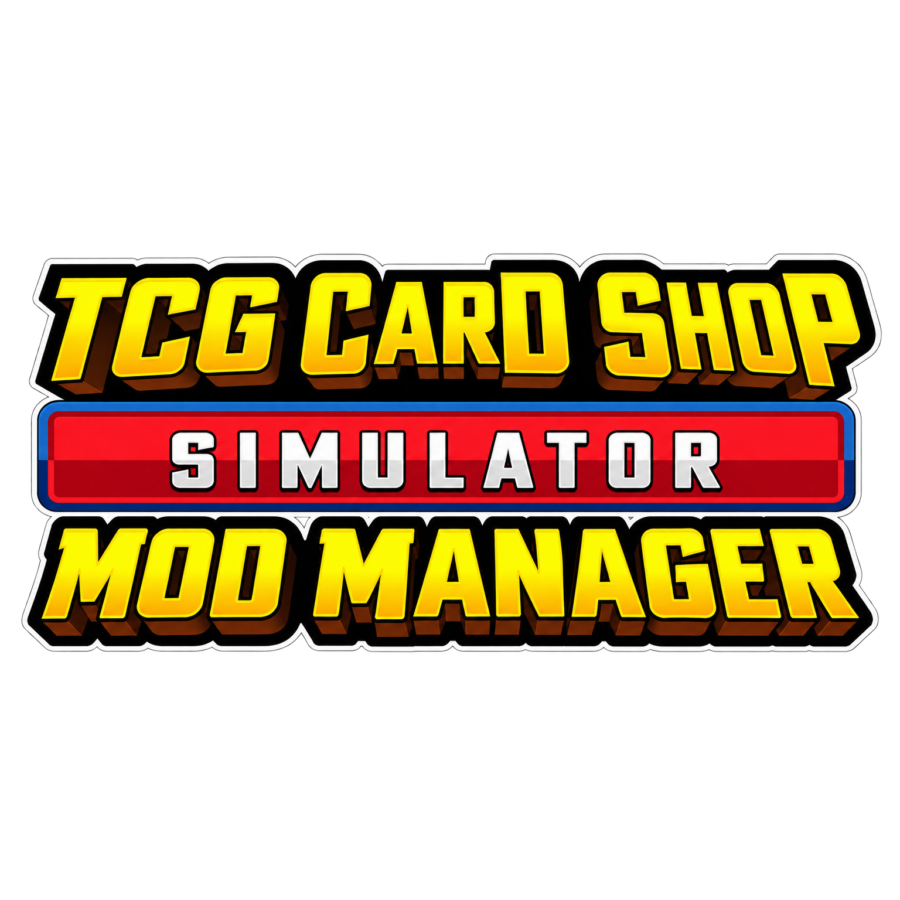

# TCG Card Shop Sim Mod Manager

This is a mod installer/manager for **TCG Card Shop Simulator** (Windows). You
list the mods you want in a JSON manifest; we verify, extract, plan, install,
journal and uninstall them, and we never silently overwrite anything.

Two front-ends share the same engine: the CLI and the desktop app both work
through `DeploymentService` in the Core project, so the app always does exactly
what the CLI does.

Status: engine, CLI, desktop UI, downloads, Nexus integration, Steam
auto-detection and in-app mod enable/disable are working. Release tooling and
docs are in place; publishing/testing to real hardware is next.

## Desktop app



Needs a display (Windows):

```
dotnet run --project src/TCGCardShopSimModManager.App
```

Pick a game folder, a manifest and the archive folder, then **Validate** (install
order, or why the list can't be installed), **Plan** (file-by-file preview),
**Install** (progress bar while it works), or type a mod name and **Uninstall**.

On open, the window tries to find TCG Card Shop Simulator through your Steam
library folders automatically and fills the game folder; if not found, use
Browse. **List mods** reads what is actually in `BepInEx/plugins`, `patchers`
and `disabled` and labels it with the journal (installed / modified / disabled /
unknown; a mod placed in the folder by hand is shown as unknown). Select a mod and use **Enable** /
**Disable** to move it out of the game into the manager's own disabled folder (beside the executable) — nothing is
deleted, and a modified file is left alone with a warning. **Update check** and
**Export bundle** round out the utilities. The title shows the version.

## Commands

```
dotnet run --project src/TCGCardShopSimModManager.Cli -- detect  [gameFolder]
dotnet run --project src/TCGCardShopSimModManager.Cli -- validate <manifest.json> [gameFolder]
dotnet run --project src/TCGCardShopSimModManager.Cli -- plan     <manifest.json> <sourceDir> <gameFolder>
dotnet run --project src/TCGCardShopSimModManager.Cli -- download <manifest.json> <httpUrlBase|localFolder|nexus> <cacheDir> <outDir>
dotnet run --project src/TCGCardShopSimModManager.Cli -- serve     <folder> [port]
dotnet run --project src/TCGCardShopSimModManager.Cli -- demo
dotnet run --project src/TCGCardShopSimModManager.Cli -- nexus     <set-key <apikey>|set-client <id> [redirectUri]|login|logout|status|clear>
dotnet run --project src/TCGCardShopSimModManager.Cli -- nexus-demo
dotnet run --project src/TCGCardShopSimModManager.Cli -- update-check
dotnet run --project src/TCGCardShopSimModManager.Cli -- support-bundle [outDir]
dotnet run --project src/TCGCardShopSimModManager.Cli -- --version
dotnet run --project src/TCGCardShopSimModManager.Cli -- install  <manifest.json> <sourceDir> <gameFolder>
dotnet run --project src/TCGCardShopSimModManager.Cli -- uninstall <modName> <gameFolder>
dotnet run --project src/TCGCardShopSimModManager.Cli -- profile  <list|use|enable|disable> ...
dotnet run --project src/TCGCardShopSimModManager.Cli -- mods     <list <gameFolder> | disable <name> <gameFolder> | enable <name> <gameFolder>>
```

- `detect`    — with a path, check it's a game install. With no path, auto-detect the game through Steam (reads the Steam library folders — no API key needed).
- `validate`  — checks the manifest and the enabled list; prints the valid install order, or every reason it can't be installed.
- `plan`      — dry run: exactly which files each archive would install, where, and what's skipped/rejected. Never touches the game.
- `download`  — fetch every archive into `outDir` through the download pipeline. Source is an http(s) base URL, a local folder, or `nexus`.
- `serve`     — host a folder over HTTP with Range support (in-process server, mainly for demos). `demo` is the one-command version: serve + download + install for you.
- `nexus`     — manage Nexus auth: `set-client` (OAuth app id), `login`/`logout`/`status` (OAuth), and `set-key`/`clear` (classic API key, development only). `nexus-demo` runs the whole Nexus path against a mock API.
- `update-check` — compares the running version with the latest GitHub release (runs only when you ask).
- `support-bundle` — zips environment info and recent diagnostics for sharing. Never includes the API key.
- `install`   — resolve the enabled list, verify order, pre-flight file conflicts, then hash-verify, extract, plan, stage, copy, journal.
- `uninstall` — removes only files whose hashes still match the journal; a modified file is warned about and left alone.
- `mods`      — list what's actually on disk (`BepInEx/plugins`, `patchers`) with journal-backed state; disable moves a mod's files out of the game into the manager's disabled folder, enable moves them back.
- `profile`   — named sets of enabled mods:

```
profile list                <gameFolder>
profile use <name>          <gameFolder>
profile enable  <id>        <manifest.json> <sourceDir> <gameFolder>
profile disable <id>        <manifest.json> <sourceDir> <gameFolder>
```

`enable` installs the mod (and its enabled dependencies, in order); `disable`
removes its files from the game directory. A profile change is only committed
once the new state is proven valid.

## Manifest

```json
{
  "manifestVersion": 1,
  "name": "Development Test List",
  "game": "tcgcardshopsimulator",
  "mods": [
    {
      "id": "example-mod",
      "name": "Example Mod",
      "version": "1.0.0",
      "archive": "ExampleMod.zip",
      "sha256": "expected-hash-here",
      "installType": "BepInExPlugin",
      "dependencies": ["shared-library"],
      "conflicts": ["old-mod"]
    }
  ]
}
```

- `id` is the key that `dependencies`, `conflicts` and profiles reference.
- `version` is optional. `dependencies`/`conflicts` are optional (empty when absent).
- For the Nexus backend add `nexusModId` (and optionally `nexusFileId`; with only
  the mod id the file is found by `archive` name via the files API).

Sample manifests live in `samples/manifests/` (`dev-test`, `archive-demo`,
`dependency-demo`, `invalid-demo` — a deliberately broken list that shows the
error output). Sample archives are in `samples/mod-archives/`.

## Dependencies, conflicts, profiles

`validate` (and `install`, before anything is touched) checks the enabled mods
and reports all problems at once:

- a dependency whose id isn't in the list, or isn't enabled;
- two enabled mods that declare each other as conflicting;
- a dependency cycle, naming the mods stuck in it.

When the list is good it returns the install order, dependencies first. `install`
won't touch the game if the enabled list is invalid.

Profiles live in `cardshopmodmanager.profiles.json` in the game folder. No
profile file means every mod in the manifest is enabled (the default). The first
`profile disable` creates a `default` profile containing everything except the
disabled mod.

Profile changes are committed only after their file operations succeed. If an
enable or disable cannot be completed, the manager rolls back its work and
leaves the saved profile unchanged.

Before copying anything, `install` builds the plan for every archive and refuses
to proceed if two mods claim the same destination file.

Installing a newer archive for the same mod id performs an update. The manager
replaces or removes only files that still match its previous journal and refuses
the update if a managed file has been changed by hand. Older journal files do
not contain stable ids or archive hashes; they remain readable and are upgraded
when the matching mod is next installed.

## Installation layout rules

An archive's structure decides where its files go, and `plan` shows the choice
before anything is installed. Rules, in order:

1. **BepInEx layout** — archive has a top-level `BepInEx/` folder → its contents mirror into the game's `BepInEx/`.
2. **Loose plugin folder** — loose `.dll` at the archive root → everything goes to `BepInEx/plugins/<mod name>/`.
3. **Patcher** — top-level `patchers/` → its contents go to `BepInEx/patchers/`; anything else to `BepInEx/plugins/<mod name>/`.
4. **Game root files** — anything else → mirrors into the game folder root.

`README`/`LICENSE`/`CHANGELOG` files and OS junk (`.DS_Store`, `__MACOSX`, ...)
are skipped, and the plan tells you what it skipped.

## Downloads

The downloader works with any source: an `IModSource` only opens the file's
bytes from a given offset (`HttpModSource`, `LocalFileSource`,
`NexusModSource`). The `ModDownloader` applies the safety rules:

- bytes are written to `<name>.partial` and only renamed to the final name after
  the whole file passes its SHA-256 check, so a cancelled or corrupt download
  leaves no valid-looking file behind;
- an existing `.partial` is resumed (HTTP Range / 206) instead of restarted;
- transient failures (5xx, network errors, corrupt payloads) are retried with
  backoff, deleting the partial between attempts;
- verified downloads are cached, so a repeat never touches the source again;
- free disk space is checked against the announced size before writing starts.

Try it in one terminal:

```
dotnet run --project src/TCGCardShopSimModManager.Cli -- demo
```

`demo` serves the archives, downloads every mod, installs them into a temp game
folder and stops the server. Run it again and the second pass shows
`(from cache)`.

## Nexus backend

Nexus is just another `IModSource`. The manifest's `nexusModId`/`nexusFileId`
resolve through the Nexus v1 API to an authenticated download URI, and the plain
HTTP source fetches the bytes. Notes:

- `nexus set-key <apikey>` stores the key encrypted with DPAPI (current user
  only) in `%LOCALAPPDATA%\TCGCardShopSimModManager\nexus-key.bin`.
- **No secrets in the repo.** The API key never lives in the project directory,
  and `.gitignore` excludes anything that would hold or reference a key
  (`nexus-key*`, `*.key`, `*apikey*`, ...). No key material exists anywhere in
  the repository, and the ignore rules are
  visible in `.gitignore`.
- Premium accounts download automatically. Free accounts get the mod page and a
  note to place the file manually — Nexus only hands premium users direct URIs.
- Rate limits are honoured: a `429` carries a `Retry-After` delay that is waited
  out before retrying.
- Archived or missing mods are reported as such.
- Requests send an identifying `User-Agent`.

`nexus-demo` runs the whole path against a mock API. For real use, set your key
(`nexus set-key <apikey>`) and optionally point `NEXUS_API_BASE` at a different
host. Personal keys are fine for development; before distributing a build it
must be registered with Nexus per its Acceptable Use Policy, and personal keys
must not be embedded in it.

## Nexus sign-in (OAuth)

Mod downloads authenticate with Nexus through OAuth 2.0 (PKCE), so the app
never sees your Nexus password and each user signs in with their own account.
This is the path used in distributed builds. The classic API-key command
(`nexus set-key`) remains for development only.

Sign-in needs a Nexus OAuth client id. Register one with Nexus by emailing
`api@nexusmods.com` with your application name, description, logo (dark
background) and a callback URI of `http://127.0.0.1:8089/callback`, then set
it once:

```
dotnet run --project src/TCGCardShopSimModManager.Cli -- nexus set-client <clientId>
```

`nexus login` opens your browser to Nexus, the app receives the redirect on a
local loopback listener, and the token is stored per user (DPAPI on Windows).
Tokens refresh automatically and are cleared with `nexus logout`.

- `nexus set-key <apikey>` stores the key encrypted with DPAPI (current user
  only) in `%LOCALAPPDATA%\TCGCardShopSimModManager\nexus-key.bin`.
- `nexus set-client <clientId>` stores the OAuth client id in
  `%LOCALAPPDATA%\TCGCardShopSimModManager\oauth-settings.json`. The client id
  is public, not a secret.
- No secrets live in the repo; `.gitignore` excludes anything that would hold or
  reference a key (`nexus-key*`, `oauth-settings.json`, `*.key`, ...).

## Safety

- Source hash must match the manifest's `sha256` before anything happens.
- Extraction happens into a temp folder and is protected: `../` paths, rooted
  paths, symbolic links, oversized archives and unexpected executables
  (`.exe`, `.bat`, `.cmd`, ...) are rejected. Nothing is extracted into the game
  directly.
- Install refuses to overwrite existing files and rejects two sources mapping
  to one destination. If a copy fails partway, everything this install created
  is rolled back.
- Every installed file is hashed in `cardshopmodmanager.journal.json` in the
  game folder, so uninstall can prove a file is still what we installed before
  deleting it.

## Supported archive formats

ZIP, using the built-in .NET support. 7z/RAR are planned; the `IArchiveExtractor`
interface makes them drop-in additions.

## Diagnostics and privacy

Every command writes a structured JSON-lines log to
`%LOCALAPPDATA%\TCGCardShopSimModManager\logs` (override with `CSMM_LOG_DIR`). An
unexpected error is captured there locally; nothing is uploaded. Export a
bundle with `support-bundle` when sharing a problem. See `PRIVACY.md`, the
`LICENSE`, and `THIRD-PARTY-NOTICES.md`. Docs for list authors and the release
testing checklist live in `docs/`, and `publish.ps1` produces a self-contained
win-x64 build into `dist/`.

## Running the tests

```
dotnet test
```
